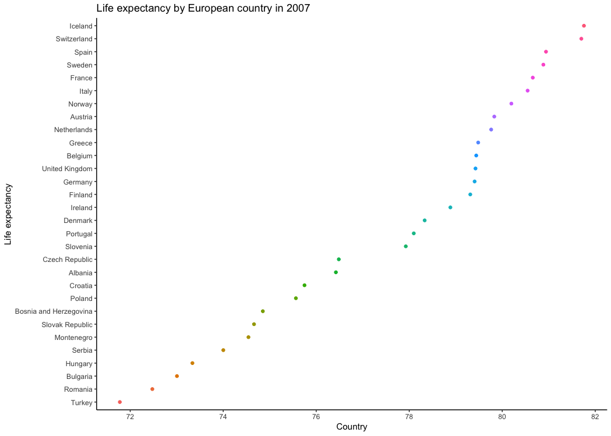

```{r setup, include=FALSE}
knitr::opts_chunk$set(echo = TRUE)
```

Welcome to my 5th homework assignment. 
This assignment has 4 parts and is about factor and figure management. 

# Part 1: Factor management
For this part I will drop factors/levels and reorder levels based on knowledge from data. 

My plan is to:
1) Drop Asia from the gapminder data and show proof.
2) Reorder the levels of country

## Drop Asia from the gapminder data set
First, I will load all the packages that this assignment requires
```{r}
suppressPackageStartupMessages(library(gapminder))
suppressPackageStartupMessages(library(tidyverse))
suppressPackageStartupMessages(library(knitr))
suppressPackageStartupMessages(library(kableExtra))
suppressPackageStartupMessages(library(plotly))
suppressPackageStartupMessages(library(scales))
```

I should mention that I will be using the **forcats** package for this part. This package is within the tidyverse package :smile: 

Let's check out the dataset!
```{r}
#view the top 6 rows of the gapmidner dataset
head(gapminder)
```

Next, I will get to know my factor before I start to work with it
```{r}
#display the internal structure of an R object
str(gapminder$continent)
#access to the levels attribute of a variable 
levels(gapminder$continent)
#how many levels there are
nlevels(gapminder$continent)
#class of the factor
class(gapminder$continent)
```

First, I will filter Asia out of my dataset into *gap_no_Asia*
```{r}
#remove Asia from dataset
gap_no_Asia <- gapminder %>%
  filter(continent != "Asia")
```

Let's see if this worked

```{r}
#How many rows are in the original dataset
nrow(gapminder)

#How many rows are in the new dataset
nrow(gap_no_Asia)
```
This makes sense! *gap_no_Asia* has been reduced by the amount of entries that there are for Asia from the original *gapminder* dataset.

However, Asia is still showing up as a continent 

```{r}
gap_no_Asia$continent %>%
  levels
```

It is necessary now to drop levels that are unused

```{r}
#Saving the variable with the unused levels dropped
gap_no_Asia_drop <- gap_no_Asia %>%
  droplevels()
```

Let's do another check to see what continents are in this *gap_no_Asia*

```{r}
gap_no_Asia_drop$continent %>%
  levels
```

We have officially dropped Asia from the **gapminder** dataset, wahoo!

## Reorder the levels of country

Next, I will reorder the levels of country by life expectancy for 2007. I will do this for the Americas to make the data set simple. Currently, they are no ordered alphabetically.

```{r}
#filtering for the continent Oceania
gap_eur_2007 <- gapminder %>%
  filter(year == 2007, continent == ("Europe"))

#showing my new data set
head(gap_eur_2007)
```
Reordering the data forwards and backwards (ascending and descending)

```{r}
# Ordering Americas by maximum life expectancy
gap_eur_2007_reorder <- gap_eur_2007 %>%
  mutate(country = fct_reorder(country, lifeExp, max)) 

#viewing the change
head(gap_eur_2007_reorder)

gap_eur_2007_reorder_backwards <- gap_eur_2007 %>%
  mutate(country = fct_reorder(country, lifeExp, max, .desc = TRUE))
```

Let's check if this really worked. I will plota figure for gap_eur_2007 and gap_eur_2007_reorder, to see if my reordering made a difference.

```{r}
#original figure
gap_eur_2007 %>%
  ggplot(aes(lifeExp, country)) +
  geom_point() +
  theme_classic() +
   ggtitle("Life expectancy of European countries in 2007 (no reordering")

#reordered figure by maximum life expectancy
gap_eur_2007_reorder %>%
  ggplot(aes(lifeExp, country)) +
  geom_point() +
  theme_classic() +
   ggtitle("Max life expectancy of European countries in 2007 (ascending)")

#figure with order descending
gap_eur_2007_reorder_backwards %>%
  ggplot(aes(lifeExp, country)) +
  geom_point() +
  theme_classic() +
   ggtitle("Max life expectancy of European countries in 2007 (descending)")
```

It is clear that reordering your data can be extremely helpful for viewing trends in figures. Before I reordered the data it is almost impossible to see a trend in the first figure. Once it is reordered it is very easy to identify the order of countries in terms of maximum life expectancy.

# Part 2: File I/O
For this part I will experiment with changing, reading, and writing files. 

My plan is to:
1) Create a new dataset
2) Write the data set to a csv file
3) Read the data set from the csv file
4) Visualize the data before and after reading the csv

## Create a new dataset

I will create a dataset from **gapminder** that is of countries in Asia, sorted by population in 2007.

```{r}
#creating the data frame
gap_Asia_2000_pop <- gapminder %>%
  filter(year == 2007, continent == ("Asia")) %>%
  arrange(pop) %>%
  droplevels() 
```

## Write the data set to a csv file

```{r}
#writing the data frame
write.csv(gap_Asia_2000_pop, file = "gap_Asia_2000_pop.csv") 
```

##  Read the data set from the csv file

```{r}
#reading the data frame
gap_Asia_2000_pop_READ <- read.csv("gap_Asia_2000_pop.csv")
```

## Visualize the data before and after reading the csv

Let's see if **gap_Asia_2000_pop** can keep it's integrity during the reading and writing process.

Before writing:
```{r}
head(gap_Asia_2000_pop) %>%
   knitr::kable(align = "c", caption = "Table before writing the file")
```

Reading the file:
```{r}
head(gap_Asia_2000_pop_READ) %>%
   knitr::kable(align = "c", caption = "Table from reading the written file")
```

It looks like the data frame survived the reading and writing process. It did not default to being ordered alphabetically, it retained it's ordering by population.

# Part 3: Visualizing design
For this part I will create a figure with what I leanrnt in recent classes in mind. I will use a figure from my 2nd homework assignment (yikes) and recreate it. 

My plan is to:
1) Show, and recreate a figure from my first homework assignment with an explanation of why it is better.
2) Recreate this figure using plotly, and expalin the benefits of using plotly.

## Show, and recreate a figure from my first homework assignment with an explanation of why it is better.

Here is the first figure I made for a homework assignment in this class:

```{r}
ggplot(gapminder, aes(continent, lifeExp)) +
  geom_point()
```

Wow... that's hard to look at after the course :smile: I guess it isn't **THAT** bad but it can definitely use some work.

I will recreate this figure with some updates:
1) x and y axis labels changes
2) figure title
3) colour scheme
4) simple theme

```{r}
ggplot(gapminder, aes(continent, lifeExp, colour=lifeExp)) +
  geom_point() +
  theme_classic() +
   ggtitle("Life expectancy by continent") +
    xlab("Continent") +
    ylab("Life expectancy") +
    theme(legend.position = "none", plot.title = element_text(hjust = 0.5))
```

## Recreate this figure using plotly, and expalin the benefits of using plotly.

For this part i'm going to use my data from the **gap_eur_2007_reorder** data frame (used in part 1) because I find it more interesting. I will make a simple figure here so you can see what it looks like before converting it to plotly:

```{r}
Plot_normal <- ggplot(gap_eur_2007_reorder, aes(lifeExp, country, colour=country)) + geom_point() +
  geom_smooth(method = loess) +
  theme_classic() +
   ggtitle("Life expectancy by European country in 2007") +
    xlab("Country") +
    ylab("Life expectancy") +
    theme(legend.position = "none")

Plot_normal
```

Now, I will convert this figure to plotly. One of the biggest benefits of plotly is that you can put your curser over any point and see what the value is. This is especially useful when there is many y-valyes like there is in my figure. It can also zoom in and out, download the plot as .png, and show statistical summaries. 

```{r}
#creating plotly 
ggplotly(Plot_normal)
```

 
# Part 4: Writing figures to file

For this part I will use *ggsave()* to save Plot_normal to a file. then I will use _! [Alt text] (/path/to/img.png)_ to load and embed it in my report. 

## saving the plot (default 7x7")
```{r}
#also specifying the scale and dpi of the figure
ggsave(filename = "KZ_Plot_normal.png", Plot_normal, dpi = 100, scale = 1.5) 
```



 
# But I want to do more!

Wait... do I?? Let's see how long this takes first. 

