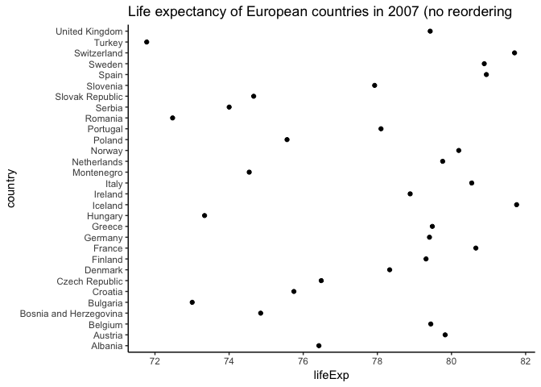
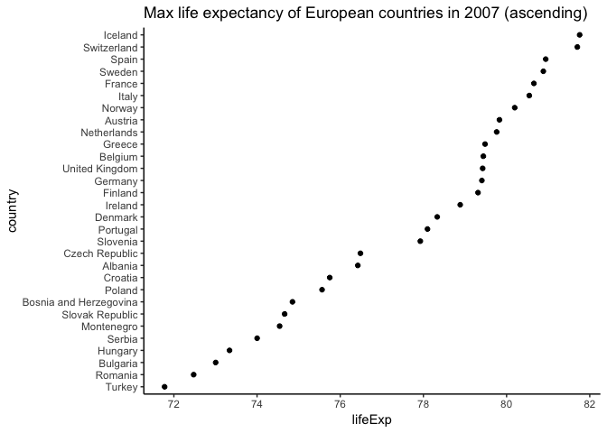
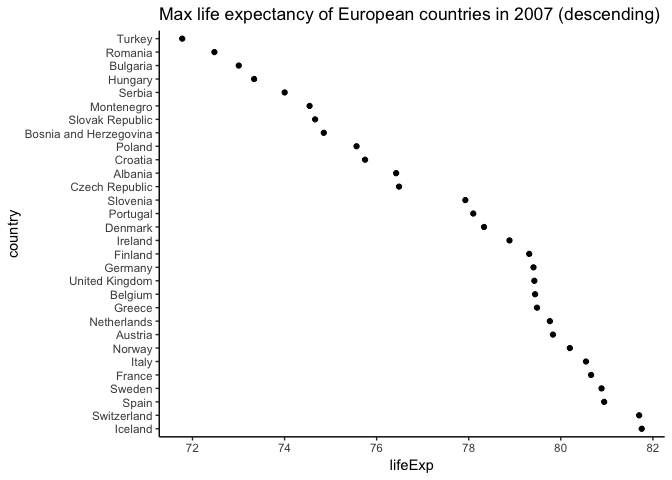
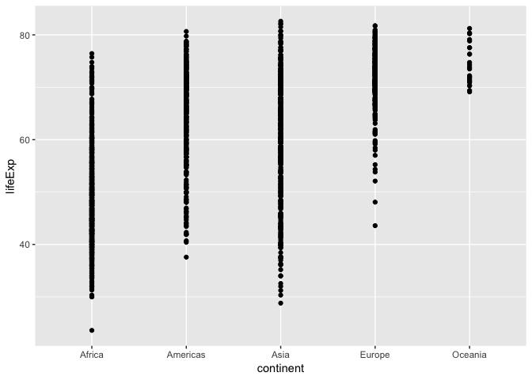
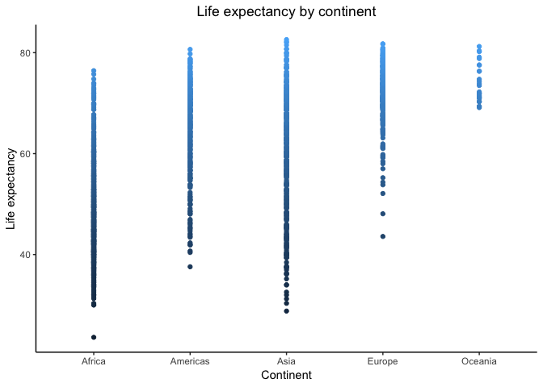

Katie's 5th homework assignment: Factor and figure management
================

-   [Part 1: Factor management](#part-1-factor-management)
    -   [Drop Asia from the gapminder data set](#drop-asia-from-the-gapminder-data-set)
    -   [Reorder the levels of country](#reorder-the-levels-of-country)
-   [Part 2: File I/O](#part-2-file-io)
    -   [Create a new dataset](#create-a-new-dataset)
    -   [Write the data set to a csv file](#write-the-data-set-to-a-csv-file)
    -   [Read the data set from the csv file](#read-the-data-set-from-the-csv-file)
    -   [Visualize the data before and after reading the csv](#visualize-the-data-before-and-after-reading-the-csv)
-   [Part 3: Visualizing design](#part-3-visualizing-design)
    -   [Show, and recreate a figure from my first homework assignment with an explanation of why it is better.](#show-and-recreate-a-figure-from-my-first-homework-assignment-with-an-explanation-of-why-it-is-better.)
    -   [Recreate this figure using plotly, and expalin the benefits of using plotly.](#recreate-this-figure-using-plotly-and-expalin-the-benefits-of-using-plotly.)

Welcome to my 5th homework assignment. This assignment has 4 parts and is about factor and figure management.

Part 1: Factor management
=========================

For this part I will drop factors/levels and reorder levels based on knowledge from data.

My plan is to: 1) Drop Asia from the gapminder data and show proof. 2) Reorder the levels of country

Drop Asia from the gapminder data set
-------------------------------------

First, I will load all the packages that this assignment requires

``` r
suppressPackageStartupMessages(library(gapminder))
suppressPackageStartupMessages(library(tidyverse))
suppressPackageStartupMessages(library(knitr))
suppressPackageStartupMessages(library(kableExtra))
suppressPackageStartupMessages(library(plotly))
suppressPackageStartupMessages(library(scales))
```

I should mention that I will be using the **forcats** package for this part. This package is within the tidyverse package :smile:

Let's check out the dataset!

``` r
#view the top 6 rows of the gapmidner dataset
head(gapminder)
```

    ## # A tibble: 6 x 6
    ##   country     continent  year lifeExp      pop gdpPercap
    ##   <fct>       <fct>     <int>   <dbl>    <int>     <dbl>
    ## 1 Afghanistan Asia       1952    28.8  8425333      779.
    ## 2 Afghanistan Asia       1957    30.3  9240934      821.
    ## 3 Afghanistan Asia       1962    32.0 10267083      853.
    ## 4 Afghanistan Asia       1967    34.0 11537966      836.
    ## 5 Afghanistan Asia       1972    36.1 13079460      740.
    ## 6 Afghanistan Asia       1977    38.4 14880372      786.

Next, I will get to know my factor before I start to work with it

``` r
#display the internal structure of an R object
str(gapminder$continent)
```

    ##  Factor w/ 5 levels "Africa","Americas",..: 3 3 3 3 3 3 3 3 3 3 ...

``` r
#access to the levels attribute of a variable 
levels(gapminder$continent)
```

    ## [1] "Africa"   "Americas" "Asia"     "Europe"   "Oceania"

``` r
#how many levels there are
nlevels(gapminder$continent)
```

    ## [1] 5

``` r
#class of the factor
class(gapminder$continent)
```

    ## [1] "factor"

First, I will filter Asia out of my dataset into *gap\_no\_Asia*

``` r
#remove Asia from dataset
gap_no_Asia <- gapminder %>%
  filter(continent != "Asia")
```

Let's see if this worked

``` r
#How many rows are in the original dataset
nrow(gapminder)
```

    ## [1] 1704

``` r
#How many rows are in the new dataset
nrow(gap_no_Asia)
```

    ## [1] 1308

This makes sense! *gap\_no\_Asia* has been reduced by the amount of entries that there are for Asia from the original *gapminder* dataset.

However, Asia is still showing up as a continent

``` r
gap_no_Asia$continent %>%
  levels
```

    ## [1] "Africa"   "Americas" "Asia"     "Europe"   "Oceania"

It is necessary now to drop levels that are unused

``` r
#Saving the variable with the unused levels dropped
gap_no_Asia_drop <- gap_no_Asia %>%
  droplevels()
```

Let's do another check to see what continents are in this *gap\_no\_Asia*

``` r
gap_no_Asia_drop$continent %>%
  levels
```

    ## [1] "Africa"   "Americas" "Europe"   "Oceania"

We have officially dropped Asia from the **gapminder** dataset, wahoo!

Reorder the levels of country
-----------------------------

Next, I will reorder the levels of country by life expectancy for 2007. I will do this for the Americas to make the data set simple. Currently, they are no ordered alphabetically.

``` r
#filtering for the continent Oceania
gap_eur_2007 <- gapminder %>%
  filter(year == 2007, continent == ("Europe"))

#showing my new data set
head(gap_eur_2007)
```

    ## # A tibble: 6 x 6
    ##   country                continent  year lifeExp      pop gdpPercap
    ##   <fct>                  <fct>     <int>   <dbl>    <int>     <dbl>
    ## 1 Albania                Europe     2007    76.4  3600523     5937.
    ## 2 Austria                Europe     2007    79.8  8199783    36126.
    ## 3 Belgium                Europe     2007    79.4 10392226    33693.
    ## 4 Bosnia and Herzegovina Europe     2007    74.9  4552198     7446.
    ## 5 Bulgaria               Europe     2007    73.0  7322858    10681.
    ## 6 Croatia                Europe     2007    75.7  4493312    14619.

Reordering the data forwards and backwards (ascending and descending)

``` r
# Ordering Americas by maximum life expectancy
gap_eur_2007_reorder <- gap_eur_2007 %>%
  mutate(country = fct_reorder(country, lifeExp, max)) 

#viewing the change
head(gap_eur_2007_reorder)
```

    ## # A tibble: 6 x 6
    ##   country                continent  year lifeExp      pop gdpPercap
    ##   <fct>                  <fct>     <int>   <dbl>    <int>     <dbl>
    ## 1 Albania                Europe     2007    76.4  3600523     5937.
    ## 2 Austria                Europe     2007    79.8  8199783    36126.
    ## 3 Belgium                Europe     2007    79.4 10392226    33693.
    ## 4 Bosnia and Herzegovina Europe     2007    74.9  4552198     7446.
    ## 5 Bulgaria               Europe     2007    73.0  7322858    10681.
    ## 6 Croatia                Europe     2007    75.7  4493312    14619.

``` r
gap_eur_2007_reorder_backwards <- gap_eur_2007 %>%
  mutate(country = fct_reorder(country, lifeExp, max, .desc = TRUE))
```

Let's check if this really worked. I will plota figure for gap\_eur\_2007 and gap\_eur\_2007\_reorder, to see if my reordering made a difference.

``` r
#original figure
gap_eur_2007 %>%
  ggplot(aes(lifeExp, country)) +
  geom_point() +
  theme_classic() +
   ggtitle("Life expectancy of European countries in 2007 (no reordering")
```



``` r
#reordered figure by maximum life expectancy
gap_eur_2007_reorder %>%
  ggplot(aes(lifeExp, country)) +
  geom_point() +
  theme_classic() +
   ggtitle("Max life expectancy of European countries in 2007 (ascending)")
```



``` r
#figure with order descending
gap_eur_2007_reorder_backwards %>%
  ggplot(aes(lifeExp, country)) +
  geom_point() +
  theme_classic() +
   ggtitle("Max life expectancy of European countries in 2007 (descending)")
```



It is clear that reordering your data can be extremely helpful for viewing trends in figures. Before I reordered the data it is almost impossible to see a trend in the first figure. Once it is reordered it is very easy to identify the order of countries in terms of maximum life expectancy.

Part 2: File I/O
================

For this part I will experiment with changing, reading, and writing files.

My plan is to: 1) Create a new dataset 2) Write the data set to a csv file 3) Read the data set from the csv file 4) Visualize the data before and after reading the csv

Create a new dataset
--------------------

I will create a dataset from **gapminder** that is of countries in Asia, sorted by population in 2007.

``` r
#creating the data frame
gap_Asia_2000_pop <- gapminder %>%
  filter(year == 2007, continent == ("Asia")) %>%
  arrange(pop) %>%
  droplevels() 
```

Write the data set to a csv file
--------------------------------

``` r
#writing the data frame
write.csv(gap_Asia_2000_pop, file = "gap_Asia_2000_pop.csv") 
```

Read the data set from the csv file
-----------------------------------

``` r
#reading the data frame
gap_Asia_2000_pop_READ <- read.csv("gap_Asia_2000_pop.csv")
```

Visualize the data before and after reading the csv
---------------------------------------------------

Let's see if **gap\_Asia\_2000\_pop** can keep it's integrity during the reading and writing process.

Before writing:

``` r
head(gap_Asia_2000_pop) %>%
   knitr::kable(align = "c", caption = "Table before writing the file")
```

<table>
<caption>
Table before writing the file
</caption>
<thead>
<tr>
<th style="text-align:center;">
country
</th>
<th style="text-align:center;">
continent
</th>
<th style="text-align:center;">
year
</th>
<th style="text-align:center;">
lifeExp
</th>
<th style="text-align:center;">
pop
</th>
<th style="text-align:center;">
gdpPercap
</th>
</tr>
</thead>
<tbody>
<tr>
<td style="text-align:center;">
Bahrain
</td>
<td style="text-align:center;">
Asia
</td>
<td style="text-align:center;">
2007
</td>
<td style="text-align:center;">
75.635
</td>
<td style="text-align:center;">
708573
</td>
<td style="text-align:center;">
29796.048
</td>
</tr>
<tr>
<td style="text-align:center;">
Kuwait
</td>
<td style="text-align:center;">
Asia
</td>
<td style="text-align:center;">
2007
</td>
<td style="text-align:center;">
77.588
</td>
<td style="text-align:center;">
2505559
</td>
<td style="text-align:center;">
47306.990
</td>
</tr>
<tr>
<td style="text-align:center;">
Mongolia
</td>
<td style="text-align:center;">
Asia
</td>
<td style="text-align:center;">
2007
</td>
<td style="text-align:center;">
66.803
</td>
<td style="text-align:center;">
2874127
</td>
<td style="text-align:center;">
3095.772
</td>
</tr>
<tr>
<td style="text-align:center;">
Oman
</td>
<td style="text-align:center;">
Asia
</td>
<td style="text-align:center;">
2007
</td>
<td style="text-align:center;">
75.640
</td>
<td style="text-align:center;">
3204897
</td>
<td style="text-align:center;">
22316.193
</td>
</tr>
<tr>
<td style="text-align:center;">
Lebanon
</td>
<td style="text-align:center;">
Asia
</td>
<td style="text-align:center;">
2007
</td>
<td style="text-align:center;">
71.993
</td>
<td style="text-align:center;">
3921278
</td>
<td style="text-align:center;">
10461.059
</td>
</tr>
<tr>
<td style="text-align:center;">
West Bank and Gaza
</td>
<td style="text-align:center;">
Asia
</td>
<td style="text-align:center;">
2007
</td>
<td style="text-align:center;">
73.422
</td>
<td style="text-align:center;">
4018332
</td>
<td style="text-align:center;">
3025.350
</td>
</tr>
</tbody>
</table>
Reading the file:

``` r
head(gap_Asia_2000_pop_READ) %>%
   knitr::kable(align = "c", caption = "Table from reading the written file")
```

<table>
<caption>
Table from reading the written file
</caption>
<thead>
<tr>
<th style="text-align:center;">
X
</th>
<th style="text-align:center;">
country
</th>
<th style="text-align:center;">
continent
</th>
<th style="text-align:center;">
year
</th>
<th style="text-align:center;">
lifeExp
</th>
<th style="text-align:center;">
pop
</th>
<th style="text-align:center;">
gdpPercap
</th>
</tr>
</thead>
<tbody>
<tr>
<td style="text-align:center;">
1
</td>
<td style="text-align:center;">
Bahrain
</td>
<td style="text-align:center;">
Asia
</td>
<td style="text-align:center;">
2007
</td>
<td style="text-align:center;">
75.635
</td>
<td style="text-align:center;">
708573
</td>
<td style="text-align:center;">
29796.048
</td>
</tr>
<tr>
<td style="text-align:center;">
2
</td>
<td style="text-align:center;">
Kuwait
</td>
<td style="text-align:center;">
Asia
</td>
<td style="text-align:center;">
2007
</td>
<td style="text-align:center;">
77.588
</td>
<td style="text-align:center;">
2505559
</td>
<td style="text-align:center;">
47306.990
</td>
</tr>
<tr>
<td style="text-align:center;">
3
</td>
<td style="text-align:center;">
Mongolia
</td>
<td style="text-align:center;">
Asia
</td>
<td style="text-align:center;">
2007
</td>
<td style="text-align:center;">
66.803
</td>
<td style="text-align:center;">
2874127
</td>
<td style="text-align:center;">
3095.772
</td>
</tr>
<tr>
<td style="text-align:center;">
4
</td>
<td style="text-align:center;">
Oman
</td>
<td style="text-align:center;">
Asia
</td>
<td style="text-align:center;">
2007
</td>
<td style="text-align:center;">
75.640
</td>
<td style="text-align:center;">
3204897
</td>
<td style="text-align:center;">
22316.193
</td>
</tr>
<tr>
<td style="text-align:center;">
5
</td>
<td style="text-align:center;">
Lebanon
</td>
<td style="text-align:center;">
Asia
</td>
<td style="text-align:center;">
2007
</td>
<td style="text-align:center;">
71.993
</td>
<td style="text-align:center;">
3921278
</td>
<td style="text-align:center;">
10461.059
</td>
</tr>
<tr>
<td style="text-align:center;">
6
</td>
<td style="text-align:center;">
West Bank and Gaza
</td>
<td style="text-align:center;">
Asia
</td>
<td style="text-align:center;">
2007
</td>
<td style="text-align:center;">
73.422
</td>
<td style="text-align:center;">
4018332
</td>
<td style="text-align:center;">
3025.350
</td>
</tr>
</tbody>
</table>
It looks like the data frame survived the reading and writing process. It did not default to being ordered alphabetically, it retained it's ordering by population.

Part 3: Visualizing design
==========================

For this part I will create a figure with what I leanrnt in recent classes in mind. I will use a figure from my 2nd homework assignment (yikes) and recreate it.

My plan is to: 1) Show, and recreate a figure from my first homework assignment with an explanation of why it is better. 2) Recreate this figure using plotly, and expalin the benefits of using plotly.

Show, and recreate a figure from my first homework assignment with an explanation of why it is better.
------------------------------------------------------------------------------------------------------

Here is the first figure I made for a homework assignment in this class:

``` r
ggplot(gapminder, aes(continent, lifeExp)) +
  geom_point()
```



Wow... that's hard to look at after the course :smile: I guess it isn't **THAT** bad but it can definitely use some work.

I will recreate this figure with some updates -x and y axis labels changes -figure title -colour scheme -simple theme

``` r
ggplot(gapminder, aes(continent, lifeExp, colour=lifeExp)) +
  geom_point() +
  theme_classic() +
   ggtitle("Life expectancy by continent") +
    xlab("Continent") +
    ylab("Life expectancy") +
    theme(legend.position = "none")
```



Recreate this figure using plotly, and expalin the benefits of using plotly.
----------------------------------------------------------------------------

For this part i'm going to use my data from the **gap\_eur\_2007\_reorder** data frame (used in part 1) because I find it more interesting. I will make a simple figure here so you can see what it looks like before converting it to plotly:

``` r
Plot_normal <- ggplot(gap_eur_2007_reorder, aes(lifeExp, country, colour=country)) + geom_point() +
  geom_smooth(method = loess) +
  theme_classic() +
   ggtitle("Life expectancy by European country in 2007") +
    xlab("Country") +
    ylab("Life expectancy") +
    theme(legend.position = "none")
```

Now, I will convert this figure to plotly.

``` r
#make plotly figure from the figure above
Plot_plotly <- ggplotly(Plot_normal)

#save plotly figure as html so we can view it
htmlwidgets::saveWidget(Plot_plotly, file = "KZ_plotly_figure.html")
```
